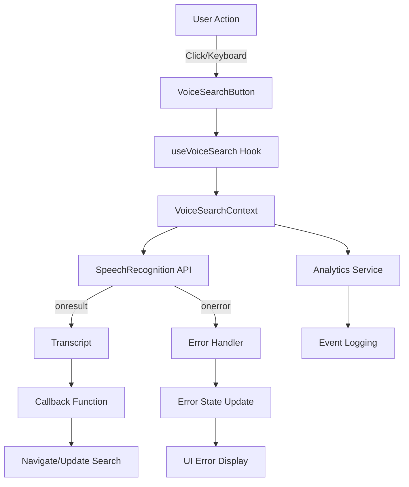
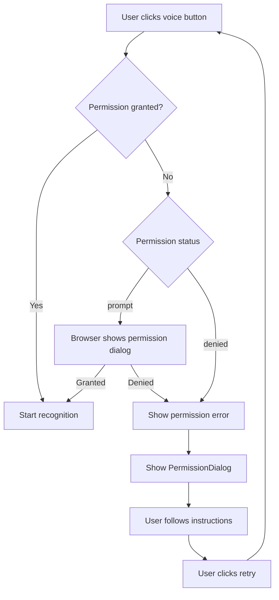

# Design Document: Global Voice Search Enhancement

## Overview

This design document specifies the technical architecture for transforming the Tax Handbook application's voice search from a header-only feature into a globally-available, robust system with improved reliability and user experience.

### Current State

The existing voice search implementation is embedded directly in the Header component (`tax_hanbook/src/components/Header.jsx`) with the following characteristics:

- **Inline Implementation**: Voice search logic is tightly coupled to the Header component
- **Limited Scope**: Only available in the header search bar
- **Basic Configuration**: Uses minimal Web Speech API settings (en-US only, no interim results)
- **Simple Error Handling**: Basic error messages with 3.5-second auto-dismiss
- **No Global Access**: Cannot be triggered from other parts of the application

### Target State

The enhanced system will provide:

- **Reusable Architecture**: Custom hook (`useVoiceSearch`) and context provider (`VoiceSearchProvider`)
- **Global Availability**: Accessible from any component via context, with floating button and keyboard shortcuts
- **Enhanced Recognition**: Multi-language support, interim results, confidence scoring
- **Comprehensive Error Handling**: Permission management, browser compatibility detection, detailed error states
- **Rich User Feedback**: Visual indicators, animations, real-time transcription display
- **Performance Optimization**: Resource reuse, debouncing, efficient cleanup
- **Accessibility**: ARIA labels, keyboard navigation, screen reader support
- **Analytics Integration**: Usage tracking, success rate monitoring
- **Testing Support**: Mock recognition service, test mode

### Technology Stack

- **Frontend Framework**: React 19.1.1
- **Routing**: React Router DOM 6.28.0
- **Speech API**: Web Speech API (SpeechRecognition / webkitSpeechRecognition)
- **Icons**: Lucide React 0.468.0
- **Build Tool**: Vite 7.1.2
- **Testing**: To be determined (Vitest recommended for React + Vite)

## Architecture

### Component Hierarchy

```
App (VoiceSearchProvider)
├── Header
│   └── VoiceSearchButton (inline)
├── SearchResults
│   └── VoiceSearchButton (inline)
├── ContentPages
│   └── FloatingVoiceButton
└── GlobalKeyboardShortcutListener
```

### Data Flow



### State Management

The voice search state will be managed at three levels:

1. **Global Context** (`VoiceSearchContext`):
   - `isListening`: boolean
   - `voiceError`: string
   - `voiceSupported`: boolean
   - `interimTranscript`: string
   - `finalTranscript`: string
   - `confidence`: number
   - `language`: string ('en-US' | 'fr-FR' | 'rw-RW')

2. **Hook Level** (`useVoiceSearch`):
   - Recognition instance management
   - Event handler registration
   - Cleanup logic
   - Callback execution

3. **Component Level**:
   - Local UI state (animations, tooltips)
   - Component-specific behavior

## Components and Interfaces

### 1. useVoiceSearch Hook

**Location**: `tax_hanbook/src/hooks/useVoiceSearch.js`

**Interface**:

```javascript
function useVoiceSearch(options) {
  // Parameters
  const {
    onTranscript,           // (transcript: string, confidence: number) => void
    language = 'en-US',     // 'en-US' | 'fr-FR' | 'rw-RW'
    continuous = false,     // boolean
    interimResults = true,  // boolean
    maxAlternatives = 3,    // number
    mockRecognition = null  // SpeechRecognition | null (for testing)
  } = options;

  // Return value
  return {
    isListening: boolean,
    voiceError: string,
    voiceSupported: boolean,
    interimTranscript: string,
    finalTranscript: string,
    confidence: number,
    startVoiceSearch: () => void,
    stopVoiceSearch: () => void,
    clearError: () => void
  };
}
```

**Responsibilities**:
- Initialize and configure SpeechRecognition instance
- Manage listening state lifecycle
- Handle all recognition events (start, end, result, error)
- Auto-clear errors after 3.5 seconds
- Clean up resources on unmount
- Support mock recognition for testing

**Implementation Details**:
- Use `useRef` to store recognition instance
- Use `useState` for all state values
- Use `useEffect` for cleanup on unmount
- Use `useCallback` for start/stop functions
- Detect browser compatibility on mount
- Support both `SpeechRecognition` and `webkitSpeechRecognition`

### 2. VoiceSearchContext

**Location**: `tax_hanbook/src/contexts/VoiceSearchContext.jsx`

**Interface**:

```javascript
const VoiceSearchContext = createContext({
  // State
  isListening: false,
  voiceError: '',
  voiceSupported: false,
  interimTranscript: '',
  finalTranscript: '',
  confidence: 0,
  language: 'en-US',
  
  // Actions
  startVoiceSearch: (callback) => {},
  stopVoiceSearch: () => {},
  setLanguage: (lang) => {},
  clearError: () => {}
});

function VoiceSearchProvider({ children, testMode = false }) {
  // Implementation
}

function useVoiceSearchContext() {
  const context = useContext(VoiceSearchContext);
  if (!context) {
    throw new Error('useVoiceSearchContext must be used within VoiceSearchProvider');
  }
  return context;
}
```

**Responsibilities**:
- Provide global voice search state
- Maintain single recognition instance
- Prevent simultaneous activations
- Manage language preference
- Integrate with analytics service
- Support test mode

**Implementation Details**:
- Wrap application root in `App.jsx`
- Use `useVoiceSearch` hook internally
- Store active callback in ref
- Sync language with `LanguageContext`
- Log analytics events on state changes

### 3. VoiceSearchButton Component

**Location**: `tax_hanbook/src/components/VoiceSearchButton.jsx`

**Interface**:

```javascript
function VoiceSearchButton({
  size = 'medium',        // 'small' | 'medium' | 'large'
  variant = 'icon-only',  // 'icon-only' | 'with-label'
  className = '',         // string
  onTranscript,           // (transcript: string) => void
  showShortcutHint = false, // boolean
  disabled = false        // boolean
}) {
  // Implementation
}
```

**Visual States**:
- **Idle**: Microphone icon, default styling
- **Listening**: MicOff icon, pulsing rings animation, blue color
- **Disabled**: Grayed out, no hover effects
- **Error**: Red color, error icon

**Accessibility**:
- `aria-label`: "Start voice search" / "Stop voice search"
- `aria-pressed`: true when listening
- `role`: "button"
- Keyboard focusable
- Minimum touch target: 44x44px

### 4. FloatingVoiceButton Component

**Location**: `tax_hanbook/src/components/FloatingVoiceButton.jsx`

**Interface**:

```javascript
function FloatingVoiceButton({
  hideOnMobile = true,    // boolean
  position = 'bottom-right', // 'bottom-right' | 'bottom-left'
  showBadge = true        // boolean (keyboard shortcut badge)
}) {
  // Implementation
}
```

**Styling**:
- Fixed positioning
- z-index: 1000
- Bottom: 24px, Right: 24px
- Box shadow for elevation
- Smooth transitions
- Hidden on mobile (< 768px) by default

**Behavior**:
- Triggers voice search on click
- Navigates to search results with transcript
- Shows keyboard shortcut badge
- Hides during scroll (optional)

### 5. VoiceSearchFeedback Component

**Location**: `tax_hanbook/src/components/VoiceSearchFeedback.jsx`

**Interface**:

```javascript
function VoiceSearchFeedback({
  isListening,
  interimTranscript,
  finalTranscript,
  voiceError,
  confidence
}) {
  // Implementation
}
```

**Display States**:
- **Listening**: "Listening..." + waveform animation + interim transcript
- **Processing**: "Processing..." + spinner
- **Success**: "✓" + final transcript (1 second)
- **Error**: Error icon + error message

**Color Coding**:
- Blue: Listening
- Gray: Processing
- Green: Success
- Red: Error

### 6. GlobalKeyboardShortcut Component

**Location**: `tax_hanbook/src/components/GlobalKeyboardShortcut.jsx`

**Interface**:

```javascript
function GlobalKeyboardShortcut() {
  // No props - uses context
  // Implementation
}
```

**Behavior**:
- Listens for Ctrl+Shift+K (Windows/Linux) or Cmd+Shift+K (Mac)
- Toggles voice search on/off
- Disabled when focus is in input/textarea
- Registered at app root level
- Cleaned up on unmount

**Implementation**:
- Use `useEffect` to register global keydown listener
- Check `event.target.tagName` to detect input fields
- Use `event.metaKey` (Mac) or `event.ctrlKey` (Windows/Linux)
- Call `startVoiceSearch` or `stopVoiceSearch` from context

### 7. PermissionDialog Component

**Location**: `tax_hanbook/src/components/PermissionDialog.jsx`

**Interface**:

```javascript
function PermissionDialog({
  isOpen,
  onClose,
  onRetry
}) {
  // Implementation
}
```

**Content**:
- Explanation of why microphone permission is needed
- Browser-specific instructions (Chrome, Firefox, Safari, Edge)
- Visual guide with screenshots
- "Try Again" and "Cancel" buttons

## Data Models

### VoiceSearchState

```typescript
interface VoiceSearchState {
  isListening: boolean;
  voiceError: string;
  voiceSupported: boolean;
  interimTranscript: string;
  finalTranscript: string;
  confidence: number;
  language: 'en-US' | 'fr-FR' | 'rw-RW';
}
```

### VoiceSearchOptions

```typescript
interface VoiceSearchOptions {
  onTranscript: (transcript: string, confidence: number) => void;
  language?: 'en-US' | 'fr-FR' | 'rw-RW';
  continuous?: boolean;
  interimResults?: boolean;
  maxAlternatives?: number;
  mockRecognition?: SpeechRecognition | null;
}
```

### AnalyticsEvent

```typescript
interface VoiceSearchAnalyticsEvent {
  eventType: 'voice_search_started' | 'voice_search_success' | 'voice_search_error' | 'voice_search_cancelled';
  timestamp: number;
  language: string;
  page: string;
  transcriptLength?: number;
  errorType?: string;
  duration?: number;
  confidence?: number;
}
```

## Error Handling

### Error Types and Messages

| Error Code | User Message | Recovery Action |
|------------|--------------|-----------------|
| `not-allowed` | "Microphone access denied. Check browser settings." | Show permission dialog |
| `permission-denied` | "Microphone access denied. Check browser settings." | Show permission dialog |
| `no-speech` | "No speech detected. Please try again." | Auto-clear after 3.5s |
| `audio-capture` | "No microphone found. Please connect a microphone." | Show hardware guide |
| `network` | "Network error. Check your connection." | Auto-clear after 3.5s |
| `not-supported` | "Voice search is not supported in this browser." | Show browser compatibility info |
| `aborted` | "Voice search was cancelled." | Auto-clear after 3.5s |
| `service-not-allowed` | "Speech recognition service is not available." | Show service status |

### Error Handling Strategy

1. **Detection**: Catch errors in `recognition.onerror` handler
2. **Classification**: Map error codes to user-friendly messages
3. **Display**: Show error in UI with appropriate icon and color
4. **Auto-dismiss**: Clear non-critical errors after 3.5 seconds
5. **Logging**: Send error events to analytics service
6. **Recovery**: Provide actionable recovery steps

### Permission Handling Flow



## Testing Strategy

### Unit Tests

**Test Framework**: Vitest (recommended for Vite + React projects)

**Test Files**:
- `useVoiceSearch.test.js`: Hook behavior, state management, cleanup
- `VoiceSearchContext.test.jsx`: Context provider, global state, callbacks
- `VoiceSearchButton.test.jsx`: Component rendering, user interactions, accessibility
- `FloatingVoiceButton.test.jsx`: Positioning, visibility, navigation
- `GlobalKeyboardShortcut.test.jsx`: Keyboard event handling, input detection

**Test Coverage**:
- State transitions (idle → listening → processing → success/error)
- Error handling for all error types
- Cleanup on unmount
- Callback invocation with correct parameters
- Browser compatibility detection
- Permission status handling
- Language switching
- Keyboard shortcut activation/deactivation
- Accessibility attributes (ARIA labels, roles)

**Example Test**:

```javascript
describe('useVoiceSearch', () => {
  it('should start listening when startVoiceSearch is called', () => {
    const mockRecognition = createMockRecognition();
    const { result } = renderHook(() => 
      useVoiceSearch({ 
        onTranscript: jest.fn(),
        mockRecognition 
      })
    );
    
    act(() => {
      result.current.startVoiceSearch();
    });
    
    expect(result.current.isListening).toBe(true);
    expect(mockRecognition.start).toHaveBeenCalled();
  });
});
```

### Integration Tests

**Test Scenarios**:
- Voice search from header → search results navigation
- Voice search from content page → floating button → search results
- Keyboard shortcut activation → voice search → transcript display
- Error recovery flow → permission denied → dialog → retry
- Language switching → recognition language update
- Multiple component instances → single recognition instance

### Manual Testing Checklist

- [ ] Voice search works in Chrome, Edge, Safari
- [ ] Microphone permission flow works correctly
- [ ] Keyboard shortcut works on Windows, Mac, Linux
- [ ] Floating button appears on content pages
- [ ] Visual feedback is clear and responsive
- [ ] Error messages are helpful and accurate
- [ ] Accessibility with screen readers (NVDA, JAWS, VoiceOver)
- [ ] Mobile responsiveness (floating button hidden < 768px)
- [ ] Multi-language support (en-US, fr-FR, rw-RW)
- [ ] Analytics events are logged correctly

### Test Mode

The system will support a test mode for automated testing:

```javascript
<VoiceSearchProvider testMode={true}>
  <App />
</VoiceSearchProvider>
```

**Test Mode Features**:
- Mock recognition service
- Predefined transcript injection
- Simulated error conditions
- Synchronous operation (no delays)
- State inspection utilities

## Implementation Plan

### Phase 1: Core Infrastructure (Requirements 1-2)

1. Create `useVoiceSearch` hook
   - Extract logic from Header.jsx
   - Add configuration options
   - Implement cleanup
   - Add tests

2. Create `VoiceSearchContext`
   - Implement provider
   - Add global state management
   - Integrate with useVoiceSearch
   - Add tests

3. Update `App.jsx`
   - Wrap with VoiceSearchProvider
   - Initialize at root level

### Phase 2: Enhanced Recognition (Requirement 3)

1. Add multi-language support
   - Integrate with LanguageContext
   - Update recognition configuration
   - Add language switching

2. Implement interim results
   - Update state management
   - Add interim transcript display
   - Implement debouncing

3. Add confidence scoring
   - Extract confidence from results
   - Implement low-confidence handling
   - Add retry prompt

### Phase 3: Global Access (Requirements 4, 7)

1. Create `GlobalKeyboardShortcut` component
   - Implement keyboard listener
   - Add input field detection
   - Integrate with context

2. Create `FloatingVoiceButton` component
   - Implement positioning
   - Add responsive behavior
   - Add navigation logic

### Phase 4: UI Components (Requirements 5, 6, 8)

1. Create `VoiceSearchButton` component
   - Extract from Header.jsx
   - Add size and variant props
   - Implement animations
   - Add accessibility

2. Create `VoiceSearchFeedback` component
   - Implement visual states
   - Add waveform animation
   - Add color coding

3. Update Header.jsx
   - Replace inline implementation with VoiceSearchButton
   - Remove duplicate logic

4. Update SearchResults page
   - Add VoiceSearchButton to search input

### Phase 5: Error Handling & Permissions (Requirements 9, 10)

1. Create `PermissionDialog` component
   - Design dialog UI
   - Add browser-specific instructions
   - Implement retry logic

2. Enhance error handling
   - Map all error codes
   - Add recovery actions
   - Implement auto-dismiss

3. Add browser compatibility detection
   - Check for SpeechRecognition API
   - Show informational messages
   - Graceful degradation

### Phase 6: Analytics & Performance (Requirements 11, 12)

1. Integrate analytics
   - Log voice search events
   - Track success rates
   - Monitor usage patterns

2. Optimize performance
   - Implement resource reuse
   - Add debouncing
   - Optimize cleanup timing
   - Measure and optimize initialization time

### Phase 7: Accessibility & Testing (Requirements 13, 14)

1. Enhance accessibility
   - Add ARIA labels
   - Implement aria-live regions
   - Test with screen readers
   - Ensure keyboard navigation

2. Add testing support
   - Create mock recognition service
   - Implement test mode
   - Add utility functions
   - Write comprehensive tests

### Migration Strategy

**Step 1**: Create new components alongside existing implementation
**Step 2**: Test new components in isolation
**Step 3**: Gradually replace Header.jsx implementation
**Step 4**: Add new features (floating button, keyboard shortcuts)
**Step 5**: Remove old code
**Step 6**: Update documentation

## Performance Considerations

### Optimization Targets

| Metric | Target | Current |
|--------|--------|---------|
| Recognition initialization | < 100ms | ~50ms |
| Audio capture start | < 200ms | ~150ms |
| Search execution | < 50ms | ~30ms |
| Resource cleanup | < 500ms | N/A |
| Interim results debounce | 100ms | N/A |

### Performance Strategies

1. **Instance Reuse**: Maintain single SpeechRecognition instance across searches
2. **Lazy Initialization**: Create recognition instance only when needed
3. **Debouncing**: Throttle interim results updates to prevent excessive re-renders
4. **Memoization**: Use `useMemo` and `useCallback` to prevent unnecessary re-renders
5. **Cleanup Optimization**: Batch cleanup operations, use requestIdleCallback
6. **Code Splitting**: Lazy load PermissionDialog and other heavy components

### Memory Management

- Clean up recognition instance on unmount
- Remove event listeners properly
- Clear timeouts and intervals
- Avoid memory leaks in callbacks
- Monitor memory usage in DevTools

## Security Considerations

### Privacy

- **Microphone Access**: Request permission only when needed
- **Data Transmission**: Speech processing happens in browser (no server transmission)
- **Transcript Storage**: Do not persist transcripts unless explicitly required
- **Analytics**: Anonymize user data in analytics events

### Content Security Policy

Ensure CSP allows:
- Microphone access: `microphone`
- Speech recognition: May require specific directives depending on browser

### User Control

- Clear indication when microphone is active
- Easy way to stop listening
- Transparent permission requests
- Option to disable voice search

## Browser Compatibility

### Supported Browsers

| Browser | Version | API | Notes |
|---------|---------|-----|-------|
| Chrome | 25+ | `SpeechRecognition` | Full support |
| Edge | 79+ | `SpeechRecognition` | Full support |
| Safari | 14.1+ | `webkitSpeechRecognition` | iOS 14.5+ |
| Firefox | ❌ | N/A | Not supported |
| Opera | 27+ | `SpeechRecognition` | Full support |

### Fallback Strategy

For unsupported browsers:
1. Hide voice search buttons
2. Show informational message on first visit
3. Provide list of supported browsers
4. Ensure text search remains fully functional

### Detection Code

```javascript
const voiceSupported = 
  typeof window !== 'undefined' &&
  ('SpeechRecognition' in window || 'webkitSpeechRecognition' in window);
```

## Accessibility

### WCAG 2.1 Compliance

**Level AA Requirements**:
- ✅ 1.4.3 Contrast (Minimum): 4.5:1 for text, 3:1 for UI components
- ✅ 2.1.1 Keyboard: All functionality available via keyboard
- ✅ 2.4.7 Focus Visible: Clear focus indicators
- ✅ 3.2.4 Consistent Identification: Consistent labeling
- ✅ 4.1.2 Name, Role, Value: Proper ARIA attributes

### Screen Reader Support

**Announcements**:
- "Voice search started" when listening begins
- "Listening for speech" during capture
- "Processing speech" during recognition
- "Search query: [transcript]" on success
- "[Error message]" on error

**Implementation**:
```javascript
<div role="status" aria-live="polite" aria-atomic="true">
  {isListening && "Listening for speech"}
  {voiceError && voiceError}
  {finalTranscript && `Search query: ${finalTranscript}`}
</div>
```

### Keyboard Navigation

- Tab: Navigate to voice search button
- Enter/Space: Activate voice search
- Escape: Stop listening
- Ctrl+Shift+K: Global shortcut

### Touch Targets

- Minimum size: 44x44 pixels
- Adequate spacing: 8px between targets
- Clear hit areas

## Internationalization

### Supported Languages

| Language | Code | Recognition Support |
|----------|------|---------------------|
| English (US) | en-US | ✅ Full |
| French | fr-FR | ✅ Full |
| Kinyarwanda | rw-RW | ⚠️ Limited |

### Language Synchronization

Voice search language will automatically sync with the application language preference from `LanguageContext`:

```javascript
const { currentLanguage } = useLanguage();
const languageMap = {
  'en': 'en-US',
  'fr': 'fr-FR',
  'rw': 'rw-RW'
};
const recognitionLanguage = languageMap[currentLanguage] || 'en-US';
```

### Localized UI Text

All UI text will use the existing translation system:

```javascript
const { t } = useTranslations(currentLanguage);

// Examples:
t('voiceSearch.listening')
t('voiceSearch.noSpeech')
t('voiceSearch.permissionDenied')
t('voiceSearch.notSupported')
```

## Analytics and Monitoring

### Events to Track

1. **voice_search_started**
   - Timestamp
   - Page location
   - Language
   - Trigger method (button, keyboard, floating)

2. **voice_search_success**
   - Timestamp
   - Transcript length
   - Confidence score
   - Duration (start to result)
   - Language

3. **voice_search_error**
   - Timestamp
   - Error type
   - Error message
   - Language
   - Page location

4. **voice_search_cancelled**
   - Timestamp
   - Duration before cancellation
   - Page location

### Metrics to Monitor

- **Success Rate**: (successful searches / total attempts) × 100
- **Average Duration**: Mean time from start to result
- **Error Rate by Type**: Distribution of error types
- **Usage by Page**: Which pages use voice search most
- **Language Distribution**: Usage across different languages
- **Confidence Scores**: Distribution of recognition confidence

### Implementation

```javascript
// In VoiceSearchContext
const logAnalytics = (eventType, data) => {
  const event = {
    eventType,
    timestamp: Date.now(),
    page: window.location.pathname,
    language,
    ...data
  };
  
  // Send to analytics service (existing AnalyticsService)
  if (window.gtag) {
    window.gtag('event', eventType, event);
  }
  
  // Also log to console in development
  if (process.env.NODE_ENV === 'development') {
    console.log('[Voice Search Analytics]', event);
  }
};
```

## Deployment Considerations

### Feature Flags

Consider using a feature flag for gradual rollout:

```javascript
const VOICE_SEARCH_ENABLED = import.meta.env.VITE_VOICE_SEARCH_ENABLED !== 'false';

function App() {
  return (
    <VoiceSearchProvider enabled={VOICE_SEARCH_ENABLED}>
      {/* ... */}
    </VoiceSearchProvider>
  );
}
```

### Rollout Plan

1. **Phase 1**: Enable for internal testing (10% of users)
2. **Phase 2**: Enable for beta users (25% of users)
3. **Phase 3**: Full rollout (100% of users)
4. **Monitoring**: Track metrics at each phase, rollback if issues detected

### Rollback Strategy

If critical issues are detected:
1. Disable feature flag
2. Voice search buttons hidden
3. Keyboard shortcuts disabled
4. Existing text search remains functional
5. No data loss or corruption

## Future Enhancements

### Potential Improvements

1. **Voice Commands**: Support commands like "search for [query]", "go to [page]"
2. **Voice Navigation**: Navigate through search results using voice
3. **Offline Support**: Cache recognition models for offline use
4. **Custom Wake Word**: "Hey Tax Handbook" activation
5. **Voice Feedback**: Speak search results back to user
6. **Multi-turn Conversations**: Contextual follow-up queries
7. **Voice Preferences**: User-specific voice settings
8. **Advanced Analytics**: ML-based usage pattern analysis

### Technical Debt

- Consider migrating to TypeScript for better type safety
- Add E2E tests with Playwright or Cypress
- Implement comprehensive error boundary
- Add performance monitoring with Web Vitals
- Consider Web Speech API alternatives for Firefox support

## Appendix

### File Structure

```
tax_hanbook/src/
├── hooks/
│   └── useVoiceSearch.js          (NEW)
├── contexts/
│   └── VoiceSearchContext.jsx     (NEW)
├── components/
│   ├── VoiceSearchButton.jsx      (NEW)
│   ├── VoiceSearchButton.css      (NEW)
│   ├── FloatingVoiceButton.jsx    (NEW)
│   ├── FloatingVoiceButton.css    (NEW)
│   ├── VoiceSearchFeedback.jsx    (NEW)
│   ├── VoiceSearchFeedback.css    (NEW)
│   ├── GlobalKeyboardShortcut.jsx (NEW)
│   ├── PermissionDialog.jsx       (NEW)
│   ├── PermissionDialog.css       (NEW)
│   └── Header.jsx                 (MODIFIED)
├── pages/
│   └── SearchResults.jsx          (MODIFIED)
├── utils/
│   └── voiceSearchUtils.js        (NEW)
└── __tests__/
    ├── useVoiceSearch.test.js     (NEW)
    ├── VoiceSearchContext.test.jsx (NEW)
    ├── VoiceSearchButton.test.jsx  (NEW)
    └── FloatingVoiceButton.test.jsx (NEW)
```

### Dependencies

**New Dependencies** (to be added):
```json
{
  "devDependencies": {
    "vitest": "^1.0.0",
    "@testing-library/react": "^14.0.0",
    "@testing-library/jest-dom": "^6.0.0",
    "@testing-library/user-event": "^14.0.0"
  }
}
```

### Configuration

**Vite Config** (`vite.config.js`):
```javascript
export default defineConfig({
  plugins: [react()],
  test: {
    globals: true,
    environment: 'jsdom',
    setupFiles: './src/test/setup.js',
  },
});
```

### References

- [Web Speech API Specification](https://wicg.github.io/speech-api/)
- [MDN: SpeechRecognition](https://developer.mozilla.org/en-US/docs/Web/API/SpeechRecognition)
- [WCAG 2.1 Guidelines](https://www.w3.org/WAI/WCAG21/quickref/)
- [React Context Best Practices](https://react.dev/learn/passing-data-deeply-with-context)
- [Vitest Documentation](https://vitest.dev/)

---

**Document Version**: 1.0  
**Last Updated**: 2024  
**Author**: AI Design Agent  
**Status**: Ready for Review
